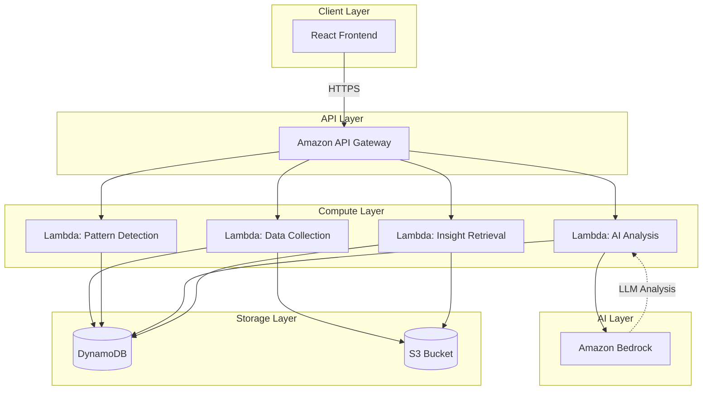
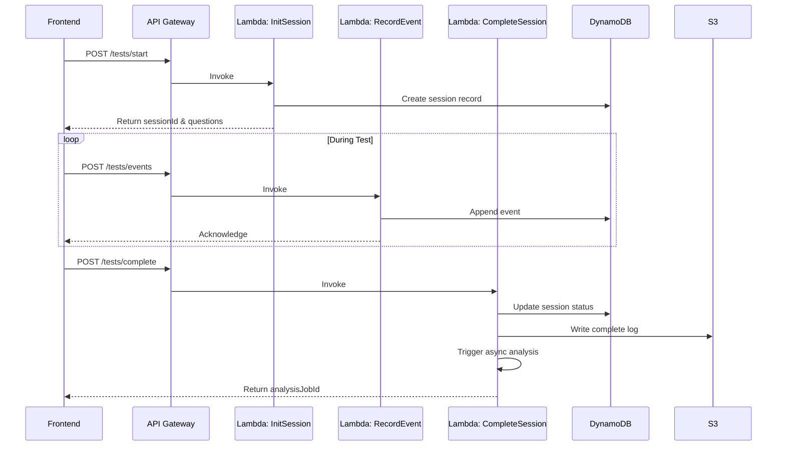
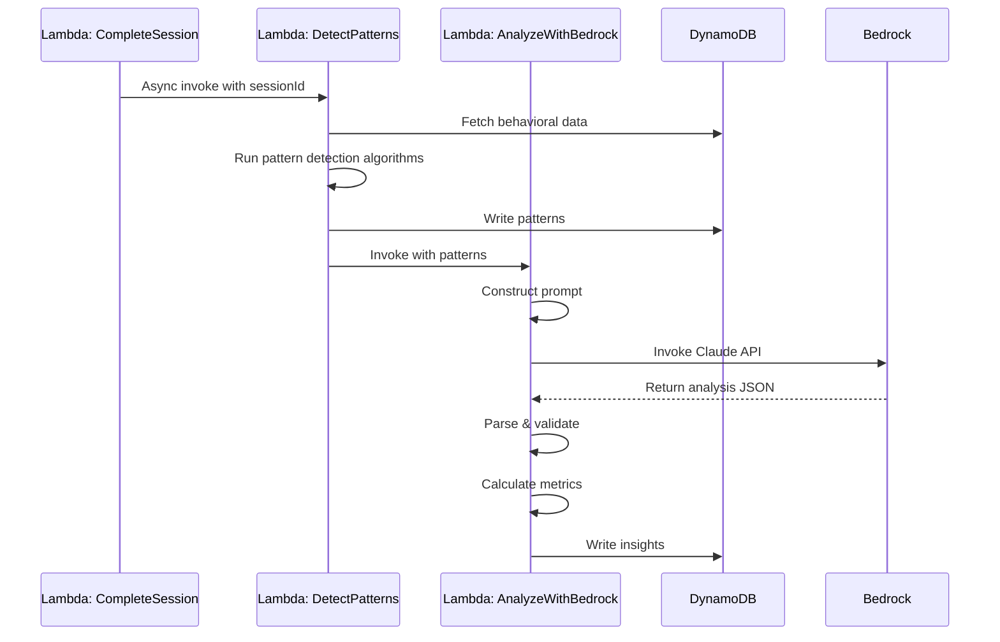
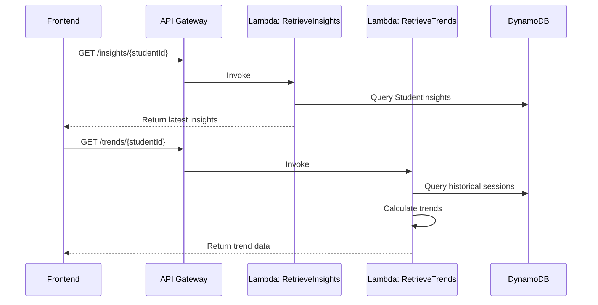

# Design Document: NeuroPrep AI

## Overview

NeuroPrep AI is a serverless, AI-powered cognitive intelligence coaching platform built on AWS. The system follows a three-tier architecture: a React frontend for user interaction, an API Gateway + Lambda middle tier for business logic, and a dual-storage backend (DynamoDB for structured data, S3 for raw test data). The core innovation is the integration of Amazon Bedrock's LLM capabilities to analyze behavioral patterns from mock tests and generate personalized cognitive insights.

The design emphasizes scalability through serverless components, security through encryption and access controls, and responsible AI through prompt engineering and output validation. The system processes behavioral data in real-time during mock tests, performs batch analysis post-test using Bedrock, and presents insights through an intuitive dashboard.

## Architecture

### High-Level Architecture



### Component Architecture

The system is organized into the following layers:

1. **Presentation Layer**: React SPA with responsive design
2. **API Gateway Layer**: Request routing, authentication, rate limiting
3. **Business Logic Layer**: Lambda functions for specific operations
4. **AI Reasoning Layer**: Bedrock integration for cognitive analysis
5. **Data Layer**: DynamoDB for structured data, S3 for raw behavioral logs

### Technology Stack

- **Frontend**: React 18+ with TypeScript, Recharts for visualization, Axios for API calls
- **API Gateway**: Amazon API Gateway (REST API) with request validation
- **Compute**: AWS Lambda (Node.js 18+ runtime)
- **AI**: Amazon Bedrock (Claude 3 Sonnet or Haiku for analysis)
- **Database**: Amazon DynamoDB with on-demand capacity
- **Storage**: Amazon S3 with lifecycle policies
- **Security**: AWS IAM, Cognito for authentication, KMS for encryption

## Components and Interfaces

### 1. React Frontend

**Responsibilities**:
- Render mock test interface with question display and timer
- Capture user interactions (answer selection, skip, navigation)
- Send behavioral events to backend via API Gateway
- Display cognitive insights dashboard with visualizations
- Manage user authentication state

**Key Modules**:
- `MockTestRunner`: Orchestrates test session, captures timestamps
- `BehavioralTracker`: Records user actions and sends to backend
- `InsightsDashboard`: Displays cognitive metrics and recommendations
- `TrendAnalyzer`: Visualizes historical performance trends
- `AuthManager`: Handles login/logout and token management

**API Interactions**:
```typescript
// Start mock test session
POST /api/tests/start
Request: { studentId: string, testId: string }
Response: { sessionId: string, questions: Question[] }

// Record behavioral event
POST /api/tests/events
Request: { sessionId: string, event: BehavioralEvent }
Response: { success: boolean }

// Complete test and trigger analysis
POST /api/tests/complete
Request: { sessionId: string }
Response: { success: boolean, analysisJobId: string }

// Retrieve insights
GET /api/insights/{studentId}
Response: { insights: CognitiveInsight[], trends: TrendData }
```

### 2. API Gateway

**Responsibilities**:
- Route requests to appropriate Lambda functions
- Validate request schemas and authentication tokens
- Implement rate limiting to prevent abuse
- Transform responses to standard format
- Enable CORS for frontend access

**Endpoints**:
- `POST /api/tests/start` → Lambda: InitializeTestSession
- `POST /api/tests/events` → Lambda: RecordBehavioralEvent
- `POST /api/tests/complete` → Lambda: CompleteTestSession
- `GET /api/insights/{studentId}` → Lambda: RetrieveInsights
- `GET /api/trends/{studentId}` → Lambda: RetrieveTrends

**Security**:
- AWS Cognito authorizer for authentication
- API keys for rate limiting
- Request throttling: 100 requests/second per user

### 3. Lambda: InitializeTestSession

**Responsibilities**:
- Create new test session record in DynamoDB
- Initialize behavioral data collection structure
- Return test questions and metadata

**Input**:
```typescript
{
  studentId: string,
  testId: string,
  timestamp: number
}
```

**Output**:
```typescript
{
  sessionId: string,
  questions: Question[],
  startTime: number
}
```

**DynamoDB Operations**:
- Write to `TestSessions` table with partition key `sessionId`
- Read from `Tests` table to fetch questions

### 4. Lambda: RecordBehavioralEvent

**Responsibilities**:
- Validate and sanitize incoming behavioral events
- Write events to DynamoDB for real-time access
- Batch events to S3 for long-term storage and analysis

**Input**:
```typescript
{
  sessionId: string,
  event: {
    type: 'view' | 'answer' | 'skip' | 'navigate',
    questionId: string,
    timestamp: number,
    timeSpent?: number,
    answerSelected?: string,
    isCorrect?: boolean
  }
}
```

**Processing Logic**:
1. Validate sessionId exists in DynamoDB
2. Append event to session's behavioral data array
3. Update session metadata (last activity timestamp)
4. If event count > 100, flush batch to S3

**DynamoDB Operations**:
- Update `TestSessions` table with new event
- Conditional write to ensure session exists

### 5. Lambda: CompleteTestSession

**Responsibilities**:
- Mark test session as complete
- Flush remaining behavioral events to S3
- Trigger asynchronous AI analysis workflow
- Calculate basic statistics (accuracy, time spent)

**Input**:
```typescript
{
  sessionId: string,
  completionTime: number
}
```

**Processing Logic**:
1. Retrieve all behavioral events for session
2. Calculate immediate statistics (total time, accuracy rate)
3. Write complete behavioral log to S3
4. Invoke `DetectCognitivePatterns` Lambda asynchronously
5. Update session status to 'completed'

**Output**:
```typescript
{
  success: boolean,
  analysisJobId: string,
  basicStats: {
    totalTime: number,
    accuracy: number,
    questionsAttempted: number
  }
}
```

### 6. Lambda: DetectCognitivePatterns

**Responsibilities**:
- Analyze behavioral data to identify cognitive patterns
- Calculate time-per-question trends
- Detect accuracy degradation over time
- Identify performance variations by difficulty level
- Detect error clustering patterns
- Calculate Fatigue_Onset_Threshold

**Input**:
```typescript
{
  sessionId: string,
  behavioralData: BehavioralEvent[]
}
```

**Pattern Detection Algorithms**:

1. **Time Trend Analysis**:
   - Calculate moving average of time-per-question
   - Identify inflection points where time increases significantly
   - Detect rushed answers (time < 20% of average)

2. **Accuracy Degradation**:
   - Split test into quartiles by time
   - Calculate accuracy for each quartile
   - Detect monotonic decrease in accuracy

3. **Difficulty Performance**:
   - Group questions by difficulty (easy, medium, hard)
   - Calculate accuracy and time for each group
   - Identify mismatches (e.g., spending too much time on easy questions)

4. **Error Clustering**:
   - Group incorrect answers by topic/type
   - Calculate error concentration using entropy
   - Identify systematic weaknesses

5. **Fatigue Detection**:
   - Find the time point where accuracy drops below baseline - 1 standard deviation
   - Calculate sustained performance duration

**Output**:
```typescript
{
  patterns: {
    timePerQuestionTrend: number[],
    accuracyByQuartile: number[],
    performanceByDifficulty: { easy: Stats, medium: Stats, hard: Stats },
    errorClusters: { topic: string, errorRate: number }[],
    fatigueOnsetMinute: number,
    rushedAnswers: number
  }
}
```

**DynamoDB Operations**:
- Write patterns to `CognitivePatterns` table with sessionId as key

### 7. Lambda: AnalyzeWithBedrock

**Responsibilities**:
- Prepare cognitive patterns for LLM analysis
- Construct structured prompts for Bedrock
- Invoke Bedrock API with retry logic
- Parse and validate LLM responses
- Generate structured insights
- Calculate Focus_Stability_Index and Strategic_Discipline_Score

**Input**:
```typescript
{
  sessionId: string,
  patterns: CognitivePatterns,
  studentHistory?: HistoricalData
}
```

**Bedrock Integration**:

Model: Claude 3 Sonnet (for detailed analysis) or Haiku (for faster processing)

Prompt Structure:
```
You are a cognitive intelligence coach analyzing a student's mock test behavior.

BEHAVIORAL DATA:
- Test Duration: {duration} minutes
- Questions Attempted: {attempted}/{total}
- Overall Accuracy: {accuracy}%
- Time per Question Trend: {trend_data}
- Accuracy by Quartile: {quartile_data}
- Performance by Difficulty: {difficulty_data}
- Error Clusters: {error_data}
- Fatigue Onset: {fatigue_minute} minutes

ANALYSIS TASKS:
1. Identify cognitive fatigue indicators and their severity
2. Detect stress-induced performance patterns
3. Evaluate strategic discipline (time allocation, question selection)
4. Calculate guessing probability for rushed answers
5. Provide 3 specific, actionable recommendations

OUTPUT FORMAT (JSON):
{
  "fatigueAnalysis": {
    "severity": "low|moderate|high",
    "indicators": string[],
    "onsetPoint": number
  },
  "stressIndicators": {
    "detected": boolean,
    "patterns": string[]
  },
  "strategicEfficiency": {
    "score": number (0-100),
    "inefficiencies": string[]
  },
  "guessingProbability": number (0-1),
  "recommendations": string[],
  "focusStabilityIndex": number (0-100),
  "strategicDisciplineScore": number (0-100)
}
```

**Processing Logic**:
1. Construct prompt with pattern data
2. Call Bedrock API with temperature=0.3 for consistency
3. Parse JSON response
4. Validate all required fields present
5. If parsing fails, retry with simplified prompt
6. Calculate performance forecast based on trends

**Output**:
```typescript
{
  insights: {
    focusStabilityIndex: number,
    fatigueOnsetThreshold: number,
    strategicDisciplineScore: number,
    recommendations: string[],
    performanceForecast: { min: number, max: number },
    detailedAnalysis: BedrockResponse
  }
}
```

**Error Handling**:
- Retry Bedrock calls up to 3 times with exponential backoff
- If Bedrock fails, generate fallback insights using rule-based logic
- Log all Bedrock interactions for monitoring

**DynamoDB Operations**:
- Write insights to `StudentInsights` table with studentId and sessionId

### 8. Lambda: RetrieveInsights

**Responsibilities**:
- Fetch latest cognitive insights for a student
- Retrieve historical trend data
- Format data for frontend consumption

**Input**:
```typescript
{
  studentId: string,
  limit?: number
}
```

**Processing Logic**:
1. Query `StudentInsights` table for student's recent sessions
2. Sort by timestamp descending
3. Return top N insights (default 10)
4. Include basic session metadata

**Output**:
```typescript
{
  insights: CognitiveInsight[],
  latestSession: {
    sessionId: string,
    testDate: number,
    focusStabilityIndex: number,
    strategicDisciplineScore: number,
    topRecommendations: string[]
  }
}
```

### 9. Lambda: RetrieveTrends

**Responsibilities**:
- Calculate historical trends across multiple test sessions
- Identify improvement or regression patterns
- Compare current performance to baseline

**Input**:
```typescript
{
  studentId: string,
  timeRange?: { start: number, end: number }
}
```

**Processing Logic**:
1. Query all sessions for student within time range
2. Extract key metrics (Focus_Stability_Index, Strategic_Discipline_Score, Fatigue_Onset_Threshold)
3. Calculate trend lines using linear regression
4. Identify significant changes (>10% improvement/decline)
5. Calculate baseline from first 3 sessions

**Output**:
```typescript
{
  trends: {
    focusStability: { values: number[], trend: 'improving'|'stable'|'declining' },
    strategicDiscipline: { values: number[], trend: string },
    fatigueThreshold: { values: number[], trend: string }
  },
  baseline: {
    focusStability: number,
    strategicDiscipline: number
  },
  significantChanges: string[]
}
```

## Data Models

### DynamoDB Tables

#### TestSessions Table
```typescript
{
  sessionId: string (PK),
  studentId: string (GSI PK),
  testId: string,
  startTime: number,
  endTime?: number,
  status: 'active' | 'completed' | 'abandoned',
  behavioralEvents: BehavioralEvent[], // Limited to recent events
  basicStats: {
    totalTime: number,
    accuracy: number,
    questionsAttempted: number
  },
  s3LogPath?: string // Path to complete behavioral log in S3
}
```

#### CognitivePatterns Table
```typescript
{
  sessionId: string (PK),
  studentId: string (GSI PK),
  analysisTimestamp: number,
  patterns: {
    timePerQuestionTrend: number[],
    accuracyByQuartile: number[],
    performanceByDifficulty: {
      easy: { accuracy: number, avgTime: number },
      medium: { accuracy: number, avgTime: number },
      hard: { accuracy: number, avgTime: number }
    },
    errorClusters: { topic: string, errorRate: number }[],
    fatigueOnsetMinute: number,
    rushedAnswers: number
  }
}
```

#### StudentInsights Table
```typescript
{
  insightId: string (PK),
  studentId: string (GSI PK),
  sessionId: string,
  timestamp: number (GSI SK for sorting),
  focusStabilityIndex: number,
  fatigueOnsetThreshold: number,
  strategicDisciplineScore: number,
  recommendations: string[],
  performanceForecast: { min: number, max: number },
  bedrockAnalysis: {
    fatigueAnalysis: object,
    stressIndicators: object,
    strategicEfficiency: object,
    guessingProbability: number
  }
}
```

### S3 Storage Structure

```
s3://neuroprep-behavioral-data/
  ├── raw-logs/
  │   └── {studentId}/
  │       └── {sessionId}/
  │           └── behavioral-log.json
  └── aggregated/
      └── {studentId}/
          └── monthly-summary-{YYYY-MM}.json
```

### Behavioral Event Schema

```typescript
interface BehavioralEvent {
  type: 'view' | 'answer' | 'skip' | 'navigate',
  questionId: string,
  timestamp: number,
  timeSpent?: number, // milliseconds
  answerSelected?: string,
  isCorrect?: boolean,
  difficulty?: 'easy' | 'medium' | 'hard',
  topic?: string
}
```

## Data Flow

### Mock Test Session Flow



### AI Analysis Flow



### Insight Retrieval Flow



## AI Workflow

### Prompt Engineering Strategy

The system uses a structured prompt engineering approach to ensure consistent, high-quality analysis from Bedrock:

1. **Context Setting**: Clearly define the AI's role as a cognitive intelligence coach
2. **Data Presentation**: Provide behavioral data in structured, labeled format
3. **Task Specification**: List explicit analysis tasks with clear objectives
4. **Output Format**: Require JSON output with predefined schema for parsing
5. **Constraint Setting**: Set temperature=0.3 for consistency, max_tokens=2000

### Prompt Template Components

```
ROLE: You are a cognitive intelligence coach...

CONTEXT: The student is preparing for {examType}...

BEHAVIORAL DATA:
[Structured data presentation]

ANALYSIS TASKS:
1. [Specific task]
2. [Specific task]
...

GUIDELINES:
- Focus on actionable insights
- Avoid discouraging language
- Base recommendations on data patterns
- Consider exam-specific strategies

OUTPUT FORMAT:
[JSON schema]
```

### Response Validation

After receiving Bedrock responses, the system validates:
1. JSON structure matches expected schema
2. All required fields are present
3. Numeric values are within valid ranges (0-100 for scores)
4. Recommendations array has 3-5 items
5. No harmful or biased language detected

### Fallback Strategy

If Bedrock analysis fails after retries:
1. Use rule-based heuristics to generate basic insights
2. Calculate Focus_Stability_Index from accuracy variance
3. Calculate Strategic_Discipline_Score from time allocation efficiency
4. Provide generic recommendations based on detected patterns
5. Flag session for manual review

## Scalability Considerations

### Lambda Scaling

- **Concurrent Execution Limit**: Set reserved concurrency for critical functions
  - RecordBehavioralEvent: 500 concurrent executions
  - AnalyzeWithBedrock: 100 concurrent executions (limited by Bedrock rate limits)
- **Memory Allocation**: 
  - Data collection functions: 256 MB
  - Pattern detection: 512 MB
  - Bedrock analysis: 1024 MB (for prompt construction and parsing)
- **Timeout Configuration**:
  - RecordBehavioralEvent: 5 seconds
  - DetectCognitivePatterns: 30 seconds
  - AnalyzeWithBedrock: 60 seconds (accounts for Bedrock latency)

### DynamoDB Scaling

- **Capacity Mode**: On-demand for automatic scaling
- **Global Secondary Indexes**:
  - StudentId-Timestamp index for efficient historical queries
  - Partition key design prevents hot partitions
- **Item Size Optimization**: 
  - Store only recent behavioral events in DynamoDB
  - Move complete logs to S3 after test completion
- **TTL**: Enable TTL on TestSessions for automatic cleanup of old sessions

### S3 Optimization

- **Lifecycle Policies**:
  - Transition raw logs to S3 Glacier after 90 days
  - Delete logs older than 2 years (compliance permitting)
- **Partitioning**: Use studentId and date-based prefixes for efficient retrieval
- **Compression**: Gzip behavioral logs before storage

### Bedrock Rate Limiting

- **Request Queuing**: Implement SQS queue for Bedrock analysis requests
- **Batch Processing**: Process multiple analysis requests in batches during off-peak hours
- **Rate Limit Handling**: Implement exponential backoff with jitter
- **Quota Monitoring**: CloudWatch alarms for approaching rate limits

### Caching Strategy

- **API Gateway Caching**: Cache GET /insights responses for 5 minutes
- **Lambda Layer Caching**: Cache common libraries and dependencies
- **Client-Side Caching**: Frontend caches insights with 10-minute TTL

## Security & Responsible AI

### Authentication & Authorization

- **User Authentication**: AWS Cognito user pools with MFA support
- **API Authorization**: Cognito authorizer on API Gateway validates JWT tokens
- **Resource Access**: Lambda functions use IAM roles with least-privilege permissions
- **Student Data Isolation**: Row-level security ensures students access only their data

### Data Encryption

- **At Rest**: 
  - DynamoDB encryption using AWS KMS
  - S3 bucket encryption with SSE-KMS
  - Separate KMS keys for different data types
- **In Transit**: 
  - HTTPS/TLS 1.3 for all API communications
  - VPC endpoints for Lambda-to-DynamoDB communication

### Privacy & Compliance

- **Data Minimization**: Collect only necessary behavioral data
- **Retention Policies**: Automatic deletion of data after retention period
- **Right to Deletion**: API endpoint for students to request data deletion
- **Anonymization**: Remove PII before using data for model improvement
- **Audit Logging**: CloudTrail logs all data access and modifications

### Responsible AI Practices

1. **Bias Mitigation**:
   - Prompts avoid demographic assumptions
   - Regular audits of AI outputs for bias patterns
   - Diverse test data for validation

2. **Transparency**:
   - Explain how insights are generated
   - Show which behavioral patterns led to recommendations
   - Provide confidence scores for predictions

3. **Positive Framing**:
   - Present cognitive patterns as improvement opportunities
   - Avoid labeling students as "weak" or "poor performers"
   - Focus on actionable strategies rather than deficiencies

4. **Output Validation**:
   - Filter harmful or discouraging language
   - Validate recommendations are exam-appropriate
   - Human review of flagged outputs

5. **Fairness**:
   - Ensure insights are equally helpful across student backgrounds
   - Monitor for performance disparities by demographic groups
   - Adjust prompts if bias detected

### Monitoring & Observability

- **CloudWatch Metrics**: Track Lambda invocations, errors, duration
- **Custom Metrics**: 
  - Bedrock API success rate
  - Analysis completion time
  - Insight quality scores (user feedback)
- **Alarms**: 
  - Lambda error rate > 5%
  - Bedrock API failures > 10%
  - DynamoDB throttling events
- **Distributed Tracing**: X-Ray for end-to-end request tracing
- **Log Aggregation**: CloudWatch Logs Insights for error analysis

### Disaster Recovery

- **DynamoDB Backups**: Point-in-time recovery enabled
- **S3 Versioning**: Enable versioning for behavioral logs
- **Cross-Region Replication**: Replicate critical data to secondary region
- **Lambda Deployment**: Blue-green deployments with automatic rollback
- **RTO/RPO**: Recovery Time Objective: 4 hours, Recovery Point Objective: 1 hour


## Correctness Properties

*A property is a characteristic or behavior that should hold true across all valid executions of a system—essentially, a formal statement about what the system should do. Properties serve as the bridge between human-readable specifications and machine-verifiable correctness guarantees.*

### Data Collection Properties

**Property 1: Session initialization creates retrievable records**
*For any* student and test combination, when a mock test session is started, querying the database with the returned sessionId should retrieve a session record with matching studentId and testId.
**Validates: Requirements 1.1**

**Property 2: Behavioral events are persisted with complete metadata**
*For any* behavioral event (view, answer, skip), when recorded during a test session, the stored event should contain all required fields: timestamp, questionId, event type, and event-specific data (timeSpent for answers, difficulty for views).
**Validates: Requirements 1.2, 1.3, 1.4**

**Property 3: Test completion persists all collected data**
*For any* test session with N behavioral events, when the test is completed, retrieving the session data should return all N events in the order they were recorded.
**Validates: Requirements 1.5, 1.6**

**Property 4: Data storage round-trip preserves integrity**
*For any* behavioral data written to storage (DynamoDB or S3), reading it back should produce data equivalent to what was written.
**Validates: Requirements 7.4**

### Pattern Detection Properties

**Property 5: Time trend analysis produces valid output**
*For any* behavioral data with at least 10 questions, the time-per-question trend analysis should produce an array of numeric values with length equal to the number of questions.
**Validates: Requirements 2.1**

**Property 6: Accuracy degradation detection identifies declining performance**
*For any* behavioral data where accuracy in the final quartile is at least 15% lower than the first quartile, the pattern detection should identify accuracy degradation.
**Validates: Requirements 2.2**

**Property 7: Performance analysis groups by difficulty correctly**
*For any* behavioral data containing questions of multiple difficulty levels, the performance analysis should produce separate statistics for each difficulty level (easy, medium, hard).
**Validates: Requirements 2.3**

**Property 8: Error clustering identifies topic concentrations**
*For any* behavioral data where more than 50% of errors occur in a single topic, the error clustering algorithm should identify that topic as a cluster.
**Validates: Requirements 2.4**

**Property 9: Fatigue threshold calculation is consistent**
*For any* behavioral data with performance decline, calculating the fatigue onset threshold twice should produce the same result.
**Validates: Requirements 2.5**

**Property 10: Strategic inefficiency detection flags time misallocation**
*For any* behavioral data where average time on easy questions exceeds average time on hard questions, the system should flag this as a strategic inefficiency.
**Validates: Requirements 2.6**

### AI Integration Properties

**Property 11: Bedrock invocation includes required prompt components**
*For any* cognitive pattern data sent to Bedrock, the constructed prompt should contain all required sections: role definition, behavioral data, analysis tasks, and output format specification.
**Validates: Requirements 3.2**

**Property 12: Bedrock response parsing extracts all required fields**
*For any* valid Bedrock JSON response, the parsing function should successfully extract fatigueAnalysis, stressIndicators, strategicEfficiency, guessingProbability, and recommendations.
**Validates: Requirements 3.3, 3.4, 3.5**

**Property 13: Response validation rejects incomplete data**
*For any* Bedrock response missing required fields (e.g., no recommendations array), the validation function should reject it and trigger a retry.
**Validates: Requirements 3.6**

### Insight Generation Properties

**Property 14: Metric calculations produce values in valid ranges**
*For any* AI analysis result, the generated Focus_Stability_Index and Strategic_Discipline_Score should be numeric values between 0 and 100 inclusive.
**Validates: Requirements 4.1, 4.2**

**Property 15: Recommendations are generated and bounded**
*For any* completed AI analysis, the system should generate between 3 and 5 specific recommendations.
**Validates: Requirements 4.3, 4.6**

**Property 16: Performance forecast includes min and max values**
*For any* completed AI analysis, the performance forecast should contain both a minimum and maximum value, where min ≤ max.
**Validates: Requirements 4.4**

### Historical Analysis Properties

**Property 17: Trend calculation requires multiple sessions**
*For any* student with N test sessions (N ≥ 2), requesting trend data should return trend arrays with N data points for each metric.
**Validates: Requirements 5.1, 5.2, 5.3**

**Property 18: Improvement detection identifies positive trends**
*For any* student whose Focus_Stability_Index increases by more than 10% from first to last session, the trend analysis should classify this as "improving".
**Validates: Requirements 5.4**

**Property 19: Baseline comparison uses early sessions**
*For any* student with at least 3 sessions, the baseline calculation should use the average of the first 3 sessions.
**Validates: Requirements 5.5**

### API and Routing Properties

**Property 20: API Gateway routes requests to correct Lambda functions**
*For any* valid API endpoint (e.g., /tests/start, /insights/{studentId}), sending a request should invoke the corresponding Lambda function.
**Validates: Requirements 8.1**

**Property 21: Error responses include appropriate status codes**
*For any* Lambda function error (validation failure, not found, server error), the API response should include the correct HTTP status code (400, 404, 500) and a descriptive error message.
**Validates: Requirements 8.5**

### Security Properties

**Property 22: Authentication gates access to protected resources**
*For any* API request without valid authentication credentials, the system should return a 401 Unauthorized response and deny access.
**Validates: Requirements 9.1**

**Property 23: Authorization enforces data isolation**
*For any* student attempting to access another student's data, the system should return a 403 Forbidden response.
**Validates: Requirements 9.4**

### Responsible AI Properties

**Property 24: Prompts exclude demographic assumptions**
*For any* prompt constructed for Bedrock, it should not contain demographic terms (gender, race, socioeconomic status, religion).
**Validates: Requirements 10.1**

**Property 25: Output validation detects harmful language**
*For any* Bedrock response containing discouraging terms (e.g., "stupid", "hopeless", "failure"), the validation function should flag it for review or regeneration.
**Validates: Requirements 10.2**

**Property 26: Insights include explanatory context**
*For any* generated insight, the response object should include an explanation field describing which behavioral patterns led to the insight.
**Validates: Requirements 10.3**

**Property 27: Language framing is positive**
*For any* generated recommendation, it should use opportunity-focused language (e.g., "improve" rather than "fix weakness").
**Validates: Requirements 10.4**

### Resilience Properties

**Property 28: Bedrock retry logic executes exactly 3 attempts**
*For any* Bedrock API call that fails, the system should retry exactly 3 times before returning an error or falling back.
**Validates: Requirements 12.1**

**Property 29: Retry backoff intervals increase exponentially**
*For any* retry sequence, the wait time between attempts should follow exponential backoff (e.g., 1s, 2s, 4s).
**Validates: Requirements 12.1**

**Property 30: Fallback insights are generated when AI fails**
*For any* test session where Bedrock analysis fails after all retries, the system should generate basic statistical insights (accuracy, time averages) as a fallback.
**Validates: Requirements 12.4**

**Property 31: Error logs contain debugging context**
*For any* error that occurs, the log entry should contain timestamp, error type, error message, request ID, and relevant context (e.g., studentId, sessionId).
**Validates: Requirements 12.5**

## Error Handling

### Error Categories

1. **Client Errors (4xx)**:
   - Invalid request format
   - Missing required fields
   - Unauthorized access
   - Resource not found

2. **Server Errors (5xx)**:
   - Lambda function failures
   - DynamoDB throttling
   - Bedrock API failures
   - Timeout errors

3. **Integration Errors**:
   - Bedrock rate limit exceeded
   - S3 upload failures
   - DynamoDB conditional check failures

### Error Handling Strategies

#### Lambda Function Errors

```typescript
try {
  // Business logic
} catch (error) {
  if (error instanceof ValidationError) {
    return {
      statusCode: 400,
      body: JSON.stringify({
        error: 'ValidationError',
        message: error.message,
        field: error.field
      })
    };
  }
  
  if (error instanceof NotFoundError) {
    return {
      statusCode: 404,
      body: JSON.stringify({
        error: 'NotFound',
        message: error.message
      })
    };
  }
  
  // Log unexpected errors
  console.error('Unexpected error:', {
    error: error.message,
    stack: error.stack,
    requestId: context.requestId
  });
  
  return {
    statusCode: 500,
    body: JSON.stringify({
      error: 'InternalServerError',
      message: 'An unexpected error occurred',
      requestId: context.requestId
    })
  };
}
```

#### Bedrock Integration Errors

```typescript
async function invokeBedrockWithRetry(prompt: string, maxRetries = 3): Promise<BedrockResponse> {
  let lastError: Error;
  
  for (let attempt = 1; attempt <= maxRetries; attempt++) {
    try {
      const response = await bedrock.invokeModel({
        modelId: 'anthropic.claude-3-sonnet-20240229-v1:0',
        body: JSON.stringify({
          anthropic_version: 'bedrock-2023-05-31',
          messages: [{ role: 'user', content: prompt }],
          max_tokens: 2000,
          temperature: 0.3
        })
      });
      
      return parseBedrockResponse(response);
    } catch (error) {
      lastError = error;
      
      if (error.name === 'ThrottlingException') {
        // Exponential backoff
        const waitTime = Math.pow(2, attempt - 1) * 1000;
        await sleep(waitTime);
        continue;
      }
      
      if (error.name === 'ValidationException') {
        // Don't retry validation errors
        throw error;
      }
      
      // Retry other errors
      if (attempt < maxRetries) {
        await sleep(1000 * attempt);
      }
    }
  }
  
  // All retries failed, use fallback
  console.error('Bedrock analysis failed after retries:', lastError);
  return generateFallbackInsights();
}
```

#### DynamoDB Error Handling

```typescript
async function writeBehavioralEvent(event: BehavioralEvent): Promise<void> {
  try {
    await dynamodb.update({
      TableName: 'TestSessions',
      Key: { sessionId: event.sessionId },
      UpdateExpression: 'SET behavioralEvents = list_append(behavioralEvents, :event)',
      ConditionExpression: 'attribute_exists(sessionId)',
      ExpressionAttributeValues: {
        ':event': [event]
      }
    });
  } catch (error) {
    if (error.name === 'ConditionalCheckFailedException') {
      throw new NotFoundError(`Session ${event.sessionId} not found`);
    }
    
    if (error.name === 'ProvisionedThroughputExceededException') {
      // Queue for retry
      await sqs.sendMessage({
        QueueUrl: process.env.RETRY_QUEUE_URL,
        MessageBody: JSON.stringify(event)
      });
      throw new RetryableError('Database temporarily unavailable');
    }
    
    throw error;
  }
}
```

### Graceful Degradation

When critical services fail, the system provides degraded but functional service:

1. **Bedrock Unavailable**: Generate rule-based insights using statistical analysis
2. **DynamoDB Throttling**: Queue writes to SQS for later processing
3. **S3 Upload Failure**: Keep data in DynamoDB temporarily, retry upload
4. **Pattern Detection Failure**: Return raw statistics without cognitive analysis

### User-Facing Error Messages

All error messages shown to users should be:
- Clear and non-technical
- Actionable when possible
- Encouraging rather than alarming

Examples:
- ❌ "DynamoDB ConditionalCheckFailedException"
- ✅ "We couldn't find that test session. Please try starting a new test."

- ❌ "Bedrock ThrottlingException"
- ✅ "Analysis is taking longer than usual. Your insights will be ready shortly."

## Testing Strategy

### Dual Testing Approach

The system requires both unit tests and property-based tests for comprehensive coverage:

- **Unit tests**: Verify specific examples, edge cases, and integration points
- **Property tests**: Verify universal properties across all inputs

Together, these approaches ensure both concrete correctness (unit tests) and general correctness (property tests).

### Property-Based Testing

**Framework**: fast-check (for TypeScript/JavaScript Lambda functions)

**Configuration**:
- Minimum 100 iterations per property test
- Each test tagged with feature name and property number
- Tag format: `Feature: neuroprep-ai, Property {N}: {property description}`

**Example Property Test**:

```typescript
import fc from 'fast-check';

// Feature: neuroprep-ai, Property 3: Test completion persists all collected data
describe('Data Collection Properties', () => {
  it('should persist all behavioral events after test completion', async () => {
    await fc.assert(
      fc.asyncProperty(
        fc.array(behavioralEventArbitrary(), { minLength: 1, maxLength: 100 }),
        async (events) => {
          // Setup: Create session and record events
          const sessionId = await createTestSession();
          for (const event of events) {
            await recordBehavioralEvent({ ...event, sessionId });
          }
          
          // Action: Complete test
          await completeTestSession(sessionId);
          
          // Assertion: All events should be retrievable
          const retrievedSession = await getSession(sessionId);
          expect(retrievedSession.behavioralEvents).toHaveLength(events.length);
          
          // Verify order is preserved
          for (let i = 0; i < events.length; i++) {
            expect(retrievedSession.behavioralEvents[i].questionId)
              .toBe(events[i].questionId);
          }
        }
      ),
      { numRuns: 100 }
    );
  });
});

// Arbitrary generator for behavioral events
function behavioralEventArbitrary() {
  return fc.record({
    type: fc.constantFrom('view', 'answer', 'skip', 'navigate'),
    questionId: fc.uuid(),
    timestamp: fc.integer({ min: 1000000000000, max: 9999999999999 }),
    timeSpent: fc.option(fc.integer({ min: 0, max: 600000 })),
    answerSelected: fc.option(fc.constantFrom('A', 'B', 'C', 'D')),
    isCorrect: fc.option(fc.boolean()),
    difficulty: fc.option(fc.constantFrom('easy', 'medium', 'hard')),
    topic: fc.option(fc.constantFrom('algebra', 'calculus', 'geometry'))
  });
}
```

### Unit Testing

**Framework**: Jest (for TypeScript/JavaScript)

**Focus Areas**:
1. **Edge Cases**:
   - Empty behavioral data
   - Single-question tests
   - All incorrect answers
   - All correct answers
   - Extremely long/short test durations

2. **Integration Points**:
   - API Gateway to Lambda routing
   - Lambda to DynamoDB writes
   - Lambda to Bedrock API calls
   - S3 upload triggers

3. **Error Conditions**:
   - Invalid session IDs
   - Malformed behavioral events
   - Bedrock API failures
   - DynamoDB throttling

**Example Unit Test**:

```typescript
describe('Pattern Detection', () => {
  it('should handle empty behavioral data gracefully', async () => {
    const patterns = await detectCognitivePatterns({
      sessionId: 'test-123',
      behavioralData: []
    });
    
    expect(patterns).toEqual({
      timePerQuestionTrend: [],
      accuracyByQuartile: [0, 0, 0, 0],
      performanceByDifficulty: {
        easy: { accuracy: 0, avgTime: 0 },
        medium: { accuracy: 0, avgTime: 0 },
        hard: { accuracy: 0, avgTime: 0 }
      },
      errorClusters: [],
      fatigueOnsetMinute: null,
      rushedAnswers: 0
    });
  });
  
  it('should detect fatigue when accuracy drops significantly', async () => {
    const behavioralData = [
      // First 10 questions: 90% accuracy, 2 min each
      ...generateQuestions(10, { accuracy: 0.9, avgTime: 120000 }),
      // Next 10 questions: 50% accuracy, 3 min each (fatigue)
      ...generateQuestions(10, { accuracy: 0.5, avgTime: 180000 })
    ];
    
    const patterns = await detectCognitivePatterns({
      sessionId: 'test-123',
      behavioralData
    });
    
    expect(patterns.fatigueOnsetMinute).toBeGreaterThan(15);
    expect(patterns.fatigueOnsetMinute).toBeLessThan(25);
  });
});
```

### Integration Testing

**Scope**: End-to-end workflows through API Gateway

**Test Scenarios**:
1. Complete mock test flow (start → record events → complete → retrieve insights)
2. Historical trend analysis with multiple sessions
3. Error recovery (Bedrock failure → fallback insights)
4. Concurrent session handling

**Example Integration Test**:

```typescript
describe('End-to-End Mock Test Flow', () => {
  it('should complete full test workflow and generate insights', async () => {
    // Start test
    const startResponse = await apiClient.post('/tests/start', {
      studentId: 'student-123',
      testId: 'jee-mock-1'
    });
    const { sessionId } = startResponse.data;
    
    // Record behavioral events
    for (let i = 0; i < 20; i++) {
      await apiClient.post('/tests/events', {
        sessionId,
        event: {
          type: 'answer',
          questionId: `q-${i}`,
          timestamp: Date.now(),
          timeSpent: 120000,
          answerSelected: 'A',
          isCorrect: Math.random() > 0.3
        }
      });
    }
    
    // Complete test
    await apiClient.post('/tests/complete', { sessionId });
    
    // Wait for async analysis
    await sleep(5000);
    
    // Retrieve insights
    const insightsResponse = await apiClient.get('/insights/student-123');
    const insights = insightsResponse.data;
    
    expect(insights.latestSession.sessionId).toBe(sessionId);
    expect(insights.latestSession.focusStabilityIndex).toBeGreaterThanOrEqual(0);
    expect(insights.latestSession.focusStabilityIndex).toBeLessThanOrEqual(100);
    expect(insights.latestSession.topRecommendations).toHaveLength(3);
  });
});
```

### Mocking Strategy

**Bedrock Mocking**:
- Use AWS SDK mocking library for unit tests
- Create fixture responses for different analysis scenarios
- Test both successful responses and error conditions

**DynamoDB Mocking**:
- Use DynamoDB Local for integration tests
- Mock DynamoDB client for unit tests
- Test conditional writes and throttling scenarios

**Frontend Testing**:
- Use React Testing Library for component tests
- Mock API calls with MSW (Mock Service Worker)
- Test loading states, error states, and data visualization

### Test Coverage Goals

- **Unit Test Coverage**: 80% code coverage minimum
- **Property Test Coverage**: All 31 correctness properties implemented
- **Integration Test Coverage**: All critical user workflows
- **E2E Test Coverage**: Happy path and major error scenarios

### Continuous Testing

- Run unit tests on every commit
- Run property tests on every pull request
- Run integration tests nightly
- Run E2E tests before production deployment
- Monitor property test failures for regression detection
